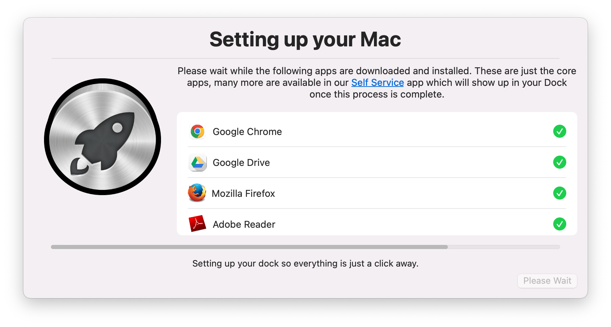

# Setup your Mac with Swift Dialog
_Leverages [swiftDialog](https://github.com/bartreardon/swiftDialog) v1.11.2 (or later) and Jamf Pro Policy Custom Events to do initial Mac setup_

_Forked from [dan-snelson Setup Your Mac](https://github.com/dan-snelson/dialog-scripts/tree/main/Setup%20Your%20Mac)_

## Installs Initial required software and other important configuration by calling Jamf Pro custom events. 
- Changed relevant Installs away from original version
- Set to run on enrollment trigger instead of Self Service
- Customized branding

